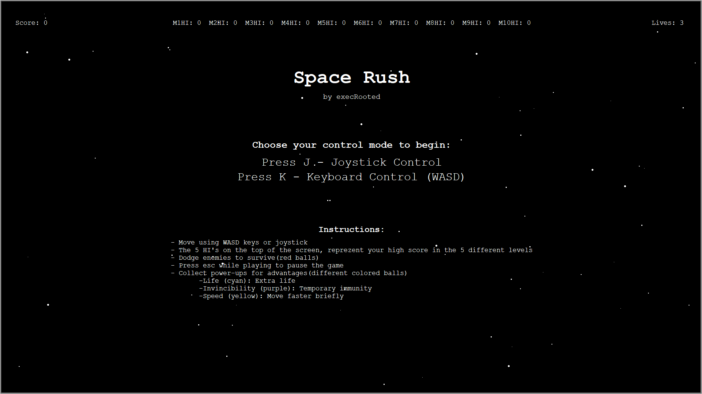

# Space Rush

A space dodging game with multiple modes, power-ups, and high score tracking. Navigate through waves of enemies while collecting power-ups to survive as long as possible! 

***Game is in the releases tab***





## Features

Press esc when playing to pause the gameplay.

- **10 Unique Game Modes**:
  - Classic Mode: Enemies come from above - Press 1 to activate
  - Falling Enemies Mode: Enemies attack from all directions - Press 2 to activate
  - Hardcore Mode: Maximum difficulty with one life - Press 3 to activate
  - Reversed Hardcore: Hardcore with inverted controls - Press 4 to activate
  - Chase Mode: Enemies pursue you before respawning - Press 5 to activate
  - Bullet Mode: Bullet bombs spawn, giving off bullets in all directions - Press 6 to activate
  - Challenge 1: Gamemodes stack up, excluding hardcore or rev hardcore - Press 7 to activate
  - Challenge 2: Exactly like Challenge 1 but with one life and no powerups(hardcore mode) - Press 8 to activate
  - Challenge 3: Exactly like Сhallenge 2 but with reversed controlls(reversed hardcore) - press 9 to activate
  - EXTREME CHALLENGE: Last challenge. Not gonna spoil teh surprise here, but you have 3 lives. - Press 0 to activate

- **Power-Up System**:
  - Life (Cyan): Gain extra lives
  - Invincibility (Purple): Temporary immunity
  - Speed (Yellow): Temporary speed boost

- **Full Audio Experience**:
  - Different background music for each mode
  - Sound effects for all actions
  - I DO NOT OWN ANY OF THE AUDIO OR SOUND EFFECTS USED.

- **Control Options**:
  - Keyboard (WASD) support
  - Joystick/Controller support

- **Persistent High Scores**:
  - Tracks best scores for each mode separately

## Installation

 **Prerequisites**:
   - Python 3.x
   - pip

 **Clone the repository(On Linux-based systems)**:
   ```bash
   git clone https://github.com/yourusername/space-rush.git
   cd space-rush
   pip install -r requirements.txt
   python3 main.py
   ```
   
   **Download the file(On Windows, Python):**  
    1. Downlaod the zip  
    2. Unzip it 
    3. Open CMD in the game directory and run: ```pip install -r requirements.txt ```  
    4. Then click on launcher.bat  
    5. Done. Enjoy! :)  
    
   **Download the file(On Windows, Releases(easier version)):**  
    1. Go to releases
    2. Downlaod Space-Rush-V1.0.0.rar 
    3. Unzip it
    4. Click on Space-Rush.exe 
    5. Done. Enjoy! :)  
---

<h2>Joystick mode setup</h2>

**To be able to play with the joystick-controlled, you need an arduino with a joystick connected to it. Here's the tutorial:**

1. Connect joystick to the arduino as so:


2. Open Arduino IDE

3. In the top right, you should find the board selection.

4. Select the com port and your arduino board

5. Upload this code to the arduino

 ```
 // Space Rush Joystick Controller
// Works with Arduino Uno and similar boards

// Pin definitions
const int X_PIN = A0;     // Joystick X axis
const int Y_PIN = A1;     // Joystick Y axis
const int BUTTON_PIN = 2; // Joystick button

// Variables
int xValue = 0;
int yValue = 0;
int buttonState = 1; // Assuming active-low button (1 = not pressed)

void setup() {
  Serial.begin(9600);
  pinMode(BUTTON_PIN, INPUT_PULLUP); // Enable internal pull-up resistor for button
}

void loop() {
  // Read joystick values
  xValue = analogRead(X_PIN);
  yValue = analogRead(Y_PIN);
  buttonState = digitalRead(BUTTON_PIN);
  
  // Send data to computer in format: "X,Y,Button"
  Serial.print(xValue);
  Serial.print(",");
  Serial.print(yValue);
  Serial.print(",");
  Serial.println(buttonState);
  
  // Small delay to prevent flooding the serial port
  delay(20);
}
 
 
  ```
  6.  In the game, when prompted, select the joystick variant, and put in the number of the coresponding port you used to upload code to your arduino.
  
7. Enjoy :)

---

*Made by execRooted*
